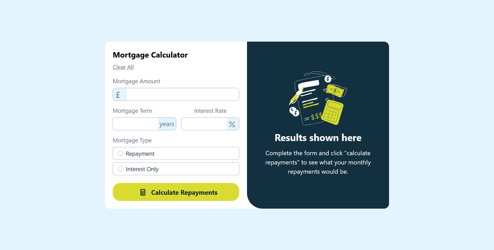

# Mortgage calculator

This is a solution to the [Mortgage repayment calculator challenge on Frontend Mentor](https://www.frontendmentor.io/challenges/mortgage-repayment-calculator-Galx1LXK73). Frontend Mentor challenges help you improve your coding skills by building realistic projects.

## Table of contents

- [Overview](#overview)
    - [The challenge](#the-challenge)
    - [Screenshot](#screenshot)
    - [Links](#links)
- [My process](#my-process)
    - [Built with](#built-with)
    - [What I learned](#what-i-learned)
    - [Continued development](#continued-development)
    - [Useful resources](#useful-resources)
- [Author](#author)
- [Acknowledgments](#acknowledgments)


## Overview

### The challenge

Users should be able to:

- Input mortgage information and see monthly repayment and total repayment amounts after submitting the form
- See form validation messages if any field is incomplete
- View the optimal layout for the interface depending on their device's screen size
- See hover and focus states for all interactive elements on the page

### Screenshot



### Links

[Live site](https://mortgage-calculator-o9zffwqzo-lethabo.vercel.app)

## My process

### Built with

- Tailwind
- CSS
- Mobile-first workflow
- [React](https://reactjs.org/)

### What I learned

Making projects responsive
```css
@media (width >= 48rem) {
  color: papayawhip;
}
```

### Continued development
- state management in react
- React component life cycle


### Useful resources

- [Scrimba](https://scrimba.com/learn-react-c0e) - This helped me in understanding props and form submission. I really liked this website and will use it going forward.


## Author

[LinkedIn](www.linkedin.com/in/lethabo-monama-1982352ab)

